# Telecom Customer Churn Prediction

An end-to-end machine learning application that predicts whether a telecom customer is likely to churn based on demographic, account, billing, contract, and subscribed-service information.

The project combines a data analysis workflow with a Streamlit web application so that users can enter customer details and receive a churn prediction and probability estimate in seconds.

> Customer churn prediction helps telecom companies identify customers who may leave and prioritize retention actions before churn occurs.

---

## Table Of Contents

- [Project Overview](#project-overview)
- [Why This Project Matters](#why-this-project-matters)
- [Key Features](#key-features)
- [Current Implementation Status](#current-implementation-status)
- [Application Workflow](#application-workflow)
- [Dataset](#dataset)
- [Feature Groups](#feature-groups)
- [Machine Learning Approach](#machine-learning-approach)
- [Model Evaluation](#model-evaluation)
- [Project Structure](#project-structure)
- [Installation](#installation)
- [Running The Application](#running-the-application)
- [Training The Model](#training-the-model)
- [Example Prediction Flow](#example-prediction-flow)
- [Technical Design Decisions](#technical-design-decisions)
- [Limitations](#limitations)
- [Roadmap](#roadmap)
- [Responsible Use](#responsible-use)
- [Contributing](#contributing)
- [License](#license)
- [Author](#author)

---

## Project Overview

Telecom companies lose revenue when customers cancel their subscriptions. Customer churn is influenced by several factors, including:

- Short customer tenure
- Month-to-month contracts
- High monthly charges
- Electronic check payments
- Lack of security or technical support services
- Internet service type
- Billing preferences
- Customer demographics and household information

This project uses the Telco Customer Churn dataset to train a classification model that estimates the probability of churn for an individual customer.

The final application allows a user to:

1. Enter customer information through a web interface.
2. Convert categorical inputs into the numerical format expected by the model.
3. Generate a churn prediction.
4. View the estimated churn probability.
5. Use the result to support customer retention analysis.

---

## Why This Project Matters

A churn prediction system can help a business move from reactive customer support to proactive retention.

Instead of contacting every customer with the same campaign, a company can prioritize customers who have a higher estimated likelihood of leaving.

Potential business applications include:

- Prioritizing retention campaigns
- Offering contract upgrades to high-risk customers
- Identifying customers who may need better technical support
- Detecting billing or pricing-related risk patterns
- Evaluating which services are associated with customer loyalty
- Supporting customer success and account management teams

The model should be used as a decision-support tool. It should not automatically determine whether a customer receives a particular service, offer, or financial decision.

---

## Key Features

### Interactive Streamlit Interface

The application provides form controls for entering customer data, including:

- Gender
- Senior citizen status
- Partner and dependent status
- Tenure
- Phone service
- Multiple lines
- Internet service
- Online security
- Online backup
- Device protection
- Technical support
- Streaming services
- Contract type
- Paperless billing
- Payment method
- Monthly charges
- Total charges

### Random Forest Classification

A Random Forest classifier is used to predict the target variable:

- `0`: Customer is predicted not to churn
- `1`: Customer is predicted to churn

Random Forest was selected because it can model nonlinear relationships, work well with mixed feature types after preprocessing, and provide feature importance values for model analysis.

### Class Imbalance Handling

The original dataset contains more non-churning customers than churning customers.

To reduce bias toward the majority class, SMOTE is applied to the training data to create a more balanced training set.

### Probability Prediction

The application uses `predict_proba()` to estimate the probability associated with each class.

The churn probability is calculated from:

```python
prediction_proba[0][1]
```

This value represents the model's estimated probability for the churn class.

### Model Serialization

The trained model and categorical encoders are saved as pickle files:

- `best_rf_model.pkl`
- `encoders.pkl`

The Streamlit application loads these files when it starts.

### Exploratory Data Analysis

The notebook includes analysis of:

- Numerical feature distributions
- Box plots
- Categorical feature counts
- Correlation between numerical variables
- Churn class distribution
- Customer service and contract patterns

### Planned Explainability Features

The project is designed to support customer-level explanations such as:

- Which features increased churn risk
- Which features reduced churn risk
- Whether contract type is a major risk factor
- Whether tenure or monthly charges affected the prediction
- Which retention action could be considered

The current Streamlit code does not yet expose these explanations in the UI. This functionality is included in the roadmap below.

---

## Current Implementation Status

| Capability | Status |
|---|---|
| Dataset loading and cleaning | Implemented |
| `TotalCharges` conversion | Implemented |
| Customer ID removal | Implemented |
| Exploratory data analysis | Implemented |
| Label encoding | Implemented |
| Training/test split | Implemented |
| SMOTE balancing | Implemented |
| Random Forest training | Implemented |
| Grid search optimization | Implemented |
| Test-set evaluation | Implemented |
| Streamlit prediction form | Implemented |
| Churn probability output | Implemented |
| Plotly gauge chart | Planned |
| Customer-level feature explanations | Planned |
| Probability calibration | Planned |
| Automated tests | Recommended |
| Deployment configuration | Recommended |

---

## Application Workflow

```mermaid
flowchart LR
    A[Telco Churn CSV] --> B[Clean Data]
    B --> C[Convert TotalCharges]
    C --> D[Remove customerID]
    D --> E[Encode Categorical Features]
    E --> F[Train/Test Split]
    F --> G[SMOTE Training Data]
    G --> H[Random Forest Grid Search]
    H --> I[Save Model and Encoders]
    I --> J[Streamlit Application]
    J --> K[User Enters Customer Details]
    K --> L[Apply Saved Encoders]
    L --> M[Predict Churn]
    M --> N[Display Probability]
```



### Step 1: Load The Dataset

The notebook loads the Telco Customer Churn CSV file into a pandas DataFrame.

```python
df = pd.read_csv("WA_Fn-UseC_-Telco-Customer-Churn.csv")
```

The dataset contains:

- 7,043 customers
- 21 original columns
- 20 columns after removing `customerID`
- 19 model features
- 1 target column named `Churn`

### Step 2: Clean The Data

The `TotalCharges` column contains blank strings for some new customers. These values are replaced with `0.0` and converted to floating-point numbers.

```python
df["TotalCharges"] = df["TotalCharges"].replace({" ": "0.0"})
df["TotalCharges"] = df["TotalCharges"].astype(float)
```

The `customerID` column is removed because it is an identifier rather than a meaningful behavioral feature.

```python
df = df.drop(columns=["customerID"])
```

### Step 3: Encode The Target

The target is converted from text to binary values:

```python
df["Churn"] = df["Churn"].replace({
    "Yes": 1,
    "No": 0
})
```

### Step 4: Encode Categorical Variables

Categorical features are converted into numerical values with `LabelEncoder`.

The encoders are stored and saved so that the Streamlit application can apply the exact same mappings to user input.

```python
encoders = {}

for column in object_columns:
    label_encoder = LabelEncoder()
    df[column] = label_encoder.fit_transform(df[column])
    encoders[column] = label_encoder
```

### Step 5: Split The Dataset

The data is split into training and test sets:

```python
X_train, X_test, y_train, y_test = train_test_split(
    X,
    y,
    test_size=0.2,
    random_state=42
)
```

The test set is kept separate so that the final model can be evaluated on data that was not used during training.

### Step 6: Balance The Training Data

SMOTE is applied to the training data:

```python
smote = SMOTE(random_state=42)

X_train_smote, y_train_smote = smote.fit_resample(
    X_train,
    y_train
)
```

The resulting training distribution is balanced:

```text
0    4138
1    4138
```

### Step 7: Train Candidate Models

The notebook compares several models:

- Decision Tree
- Random Forest
- XGBoost

The Random Forest model produced the strongest cross-validation performance among the tested models.

### Step 8: Tune The Random Forest

Grid search is used to evaluate multiple Random Forest configurations.

The selected configuration was:

```python
RandomForestClassifier(
    max_depth=None,
    min_samples_leaf=1,
    min_samples_split=5,
    n_estimators=30,
    random_state=42
)
```

### Step 9: Save The Model

The final model is saved to disk:

```python
with open("best_rf_model.pkl", "wb") as f:
    pickle.dump(best_rf_model, f)
```

The label encoders are saved separately:

```python
with open("encoders.pkl", "wb") as f:
    pickle.dump(encoders, f)
```

### Step 10: Generate Predictions

The Streamlit app loads the saved model and encoders, transforms the submitted form values, and generates a prediction:

```python
prediction = model.predict(user_df)
prediction_proba = model.predict_proba(user_df)
```

---

## Dataset

This project uses the Telco Customer Churn dataset.

The target column is:

```text
Churn
```

Target values:

| Value | Meaning |
|---:|---|
| `0` | Customer did not churn |
| `1` | Customer churned |

The original target distribution is:

| Class | Customers |
|---|---:|
| No churn | 5,174 |
| Churn | 1,869 |

This means that approximately 26.5% of the customers in the dataset churned.

---

## Feature Groups

### Demographic Features

| Feature | Description |
|---|---|
| `gender` | Customer gender |
| `SeniorCitizen` | Whether the customer is a senior citizen |
| `Partner` | Whether the customer has a partner |
| `Dependents` | Whether the customer has dependents |

### Account Features

| Feature | Description |
|---|---|
| `tenure` | Number of months the customer has stayed with the company |
| `Contract` | Contract duration |
| `PaperlessBilling` | Whether the customer uses paperless billing |
| `PaymentMethod` | Customer payment method |
| `MonthlyCharges` | Current monthly bill |
| `TotalCharges` | Total amount charged to the customer |

### Service Features

| Feature | Description |
|---|---|
| `PhoneService` | Whether the customer has phone service |
| `MultipleLines` | Whether the customer has multiple phone lines |
| `InternetService` | Internet service type |
| `OnlineSecurity` | Online security subscription |
| `OnlineBackup` | Online backup subscription |
| `DeviceProtection` | Device protection subscription |
| `TechSupport` | Technical support subscription |
| `StreamingTV` | Streaming TV subscription |
| `StreamingMovies` | Streaming movie subscription |

---

## Machine Learning Approach

### Problem Type

This is a supervised binary classification problem.

The model learns from historical customer records where the churn outcome is known and then predicts the outcome for a new customer.

### Model

The main model is:

```text
RandomForestClassifier
```

A Random Forest is an ensemble of decision trees. Each tree learns a different view of the training data, and the forest combines their predictions.

This is useful for churn prediction because customer behavior often depends on combinations of features rather than one isolated variable.

For example:

- A month-to-month contract may be more risky for a new customer than for a long-term customer.
- A high monthly charge may be more significant when the customer has few support services.
- Payment method, tenure, and contract type may interact with one another.

### Preprocessing

The current preprocessing pipeline performs the following:

1. Converts `TotalCharges` to numeric format.
2. Removes `customerID`.
3. Encodes categorical features.
4. Separates features and target.
5. Splits training and test data.
6. Applies SMOTE to the training data.
7. Trains the Random Forest model.

---

## Model Evaluation

The model was evaluated on a holdout test set containing 20% of the original data.

### Test-Set Results

| Metric | Result |
|---|---:|
| Accuracy | 77.50% |
| Precision for non-churn | 85% |
| Recall for non-churn | 84% |
| F1-score for non-churn | 85% |
| Precision for churn | 57% |
| Recall for churn | 60% |
| F1-score for churn | 59% |
| Macro F1-score | 72% |

### Confusion Matrix

```text
[[868, 168],
 [149, 224]]
```

Interpretation:

| | Predicted No Churn | Predicted Churn |
|---|---:|---:|
| Actual No Churn | 868 | 168 |
| Actual Churn | 149 | 224 |

The model correctly identified 224 customers who churned. It missed 149 customers who actually churned, which is why improving churn recall is an important future goal.

### Important Evaluation Note

The notebook reports approximately 84% cross-validation accuracy on the SMOTE-balanced training data and approximately 77.5% accuracy on the original holdout test set.

These numbers should not be treated as equivalent. The holdout result is the more important estimate of performance on unseen customer records.

For a production churn system, accuracy alone should not be the main success metric. A better evaluation strategy would include:

- Churn recall
- Churn precision
- F1-score
- ROC-AUC
- PR-AUC
- Calibration
- Cost of false negatives
- Cost of false positives
- Retention campaign conversion rate

---

## Project Structure

A recommended project structure is:

```text
telecom-customer-churn-prediction/
│
├── app.py
├── train_model.py
├── requirements.txt
├── README.md
├── LICENSE
│
├── data/
│   └── WA_Fn-UseC_-Telco-Customer-Churn.csv
│
├── models/
│   ├── best_rf_model.pkl
│   └── encoders.pkl
│
├── notebooks/
│   └── telecom_customer_churn.ipynb
│
└── screenshots/
    ├── dashboard.png
    └── prediction-result.png
```

### File Descriptions

| File | Purpose |
|---|---|
| `app.py` | Streamlit application |
| `train_model.py` | Reusable model-training script |
| `requirements.txt` | Python dependencies |
| `best_rf_model.pkl` | Trained Random Forest model |
| `encoders.pkl` | Saved categorical encoders |
| `telecom_customer_churn.ipynb` | Exploratory analysis and model development |
| `data/` | Dataset files |
| `screenshots/` | Application screenshots |

---

## Installation

### Requirements

- Python 3.9 or later
- pip
- Streamlit
- pandas
- NumPy
- scikit-learn
- imbalanced-learn
- matplotlib
- seaborn

Optional dependencies:

- Plotly for the planned gauge visualization
- XGBoost for model comparison

### Create A Virtual Environment

```bash
python -m venv .venv
```

Activate it on macOS or Linux:

```bash
source .venv/bin/activate
```

Activate it on Windows:

```bash
.venv\Scripts\activate
```

### Install Dependencies

```bash
pip install -r requirements.txt
```

A suitable `requirements.txt` file is:

```text
streamlit
pandas
numpy
scikit-learn
imbalanced-learn
matplotlib
seaborn
xgboost
plotly
```

---

## Running The Application

Before launching the app, confirm that the following files are available:

```text
best_rf_model.pkl
encoders.pkl
app.py
```

Run the application with:

```bash
streamlit run app.py
```

Then open the local Streamlit URL shown in the terminal.

The app will:

1. Load the serialized Random Forest model.
2. Load the saved categorical encoders.
3. Display customer input controls.
4. Transform the submitted values.
5. Generate a churn prediction.
6. Display the churn result and probability.

---

## Training The Model

The current notebook was originally created in Google Colab. The dataset path currently points to:

```python
/content/WA_Fn-UseC_-Telco-Customer-Churn.csv
```

For local development, replace it with a project-relative path:

```python
df = pd.read_csv(
    "data/WA_Fn-UseC_-Telco-Customer-Churn.csv"
)
```

To retrain the model:

```bash
jupyter notebook notebooks/telecom_customer_churn.ipynb
```

Or convert the training cells into a script:

```bash
python train_model.py
```

The training process should generate:

```text
models/best_rf_model.pkl
models/encoders.pkl
```

If the model files are stored in the `models/` directory, update the paths in `app.py`:

```python
with open("models/best_rf_model.pkl", "rb") as f:
    model = pickle.load(f)

with open("models/encoders.pkl", "rb") as f:
    encoders = pickle.load(f)
```

---

## Example Prediction Flow

A customer with the following profile may be considered higher risk by the model:

```text
Contract: Month-to-month
Tenure: Low
InternetService: Fiber optic
PaymentMethod: Electronic check
MonthlyCharges: Relatively high
OnlineSecurity: No
TechSupport: No
PaperlessBilling: Yes
```

The model combines all available input features and returns:

```text
Prediction: Likely to churn
Churn probability: 0.XX
```

The probability should be interpreted as a model estimate, not as a guaranteed outcome.

---

## Technical Design Decisions

### Why Random Forest?

Random Forest was selected because it:

- Handles nonlinear decision boundaries
- Performs well on tabular data
- Requires limited feature scaling
- Is relatively robust to noisy features
- Supports probability prediction
- Provides feature importance values
- Is easy to serialize and load in a lightweight application

### Why Streamlit?

Streamlit allows the model to be exposed through a usable interface without building a separate frontend and backend system.

This makes it suitable for:

- Demonstrations
- Internal analytics tools
- Model prototyping
- Stakeholder feedback
- Portfolio and technical interview projects

### Why SMOTE?

The churn class is smaller than the non-churn class. SMOTE increases representation of the minority class in the training data so the model has more opportunity to learn churn patterns.

SMOTE is applied only to the training data. The test data remains in its original distribution.

### Why Save Encoders?

The model was trained on encoded categorical values. The same mappings must be used during inference.

Saving the encoders prevents the application from creating a different category-to-number mapping after deployment.

---

## Limitations

### Label Encoding For Categorical Features

The current version uses `LabelEncoder` for feature columns. This converts categories into integer values.

For example:

```text
Month-to-month -> 0
One year -> 1
Two year -> 2
```

Although Random Forest can use the encoded values, the numeric order does not represent a true mathematical relationship between categories.

A stronger production implementation should use:

- `OneHotEncoder`
- `ColumnTransformer`
- A scikit-learn or imbalanced-learn `Pipeline`
- `SMOTENC` for mixed numerical and categorical features

### SMOTE And Categorical Values

SMOTE is currently applied after label encoding. This can create synthetic values between categorical codes, even though those intermediate values do not represent real categories.

A production-oriented version should use `SMOTENC` or an alternative sampling strategy designed for categorical variables.

### Cross-Validation Leakage Risk

The current notebook applies SMOTE before cross-validation. This can allow synthetic information to influence validation folds.

A safer approach is to include SMOTE inside an imbalanced-learn pipeline:

```python
from imblearn.pipeline import Pipeline
from imblearn.over_sampling import SMOTENC

pipeline = Pipeline([
    ("preprocessor", preprocessor),
    ("sampler", SMOTENC(
        categorical_features=categorical_indices,
        random_state=42
    )),
    ("model", RandomForestClassifier(
        random_state=42
    ))
])
```

This ensures resampling is performed separately inside each training fold.

### Probability Calibration

Random Forest probabilities are not automatically guaranteed to be calibrated.

If the application will be used for customer prioritization, calibration should be evaluated with:

- Calibration curves
- Brier score
- `CalibratedClassifierCV`

### No Business Threshold Optimization

The current application uses the default classification threshold.

A telecom company may prefer to optimize for:

- Higher churn recall
- Lower retention campaign cost
- Higher precision among contacted customers
- A specific customer acquisition value

The best threshold depends on the business cost of false positives and false negatives.

### Limited Explainability In Current UI

The model currently returns a prediction and probability. It does not yet show a customer-specific explanation.

A feature importance chart alone explains the model globally. It does not explain why a particular customer received a particular prediction.

---

## Roadmap

### Explainable Predictions

Add local explanations using one of the following approaches:

- SHAP TreeExplainer
- Local feature contribution analysis
- Per-customer counterfactual analysis

The UI could display:

```text
Factors increasing churn risk:
- Month-to-month contract
- Low tenure
- Electronic check payment
- No technical support

Factors reducing churn risk:
- Long-term contract
- High tenure
- Automatic payment method
```

### Plotly Churn Gauge

Add a gauge chart to make the churn probability easier to interpret.

Suggested risk bands:

| Probability | Risk Level |
|---:|---|
| 0% to 30% | Low |
| 30% to 60% | Medium |
| 60% to 100% | High |

The thresholds should be validated with business stakeholders instead of being treated as universal rules.

### Better Preprocessing Pipeline

Replace manual label encoding with a reproducible pipeline using:

- `ColumnTransformer`
- `OneHotEncoder`
- `StandardScaler` where appropriate
- `SMOTENC`
- A serialized pipeline containing preprocessing and the model

### Model Comparison

Compare additional models using the same validation protocol:

- Logistic Regression
- Random Forest
- XGBoost
- LightGBM
- CatBoost
- Gradient Boosting

### Better Evaluation

Add:

- ROC-AUC
- PR-AUC
- Calibration curve
- Threshold comparison
- Cross-validation confidence intervals
- Error analysis by customer segment

### Deployment

Possible deployment targets include:

- Streamlit Community Cloud
- Docker
- Render
- Railway
- Azure App Service
- AWS
- Google Cloud Run

A deployment version should include:

- Pinned dependencies
- Model versioning
- Input validation
- Logging
- Health checks
- Monitoring for data drift

---

## Responsible Use

This model predicts customer behavior using historical data. It should be used to support human decision-making, not replace it.

Recommended safeguards:

- Do not use predictions to deny essential services.
- Do not treat probability as certainty.
- Review predictions for potential demographic bias.
- Avoid using sensitive features unless there is a clear business and legal justification.
- Explain to decision-makers that model outputs are estimates.
- Monitor performance across different customer groups.
- Re-evaluate the model when customer behavior or pricing policies change.

---

## Contributing

Contributions are welcome.

Suggested contribution workflow:

1. Fork the repository.
2. Create a feature branch.

```bash
git checkout -b feature/improve-model-explainability
```

3. Make the changes.
4. Add or update tests.
5. Update the documentation.
6. Commit the changes.

```bash
git commit -m "Add local churn explanations"
```

7. Push the branch.

```bash
git push origin feature/improve-model-explainability
```

8. Open a pull request.

---

## License

This project is available under the MIT License.

Add a `LICENSE` file to the repository if you choose to publish the project under this license.

---

## Author

**Your Name**

- GitHub: `https://github.com/your-username`
- LinkedIn: `https://www.linkedin.com/in/your-profile`
- Email: `your-email@example.com`

---

## Project Summary

This project demonstrates how machine learning can be applied to a practical business problem using a complete workflow:

```text
Data collection
    -> Data cleaning
    -> Exploratory analysis
    -> Feature preprocessing
    -> Class imbalance handling
    -> Model training
    -> Hyperparameter tuning
    -> Model evaluation
    -> Model serialization
    -> Streamlit deployment
```

The result is an interactive telecom churn prediction system that transforms customer information into an actionable churn-risk estimate.
